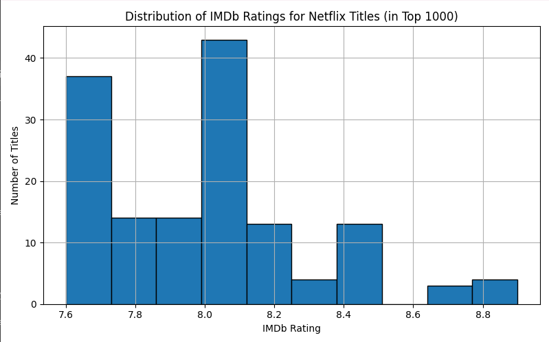
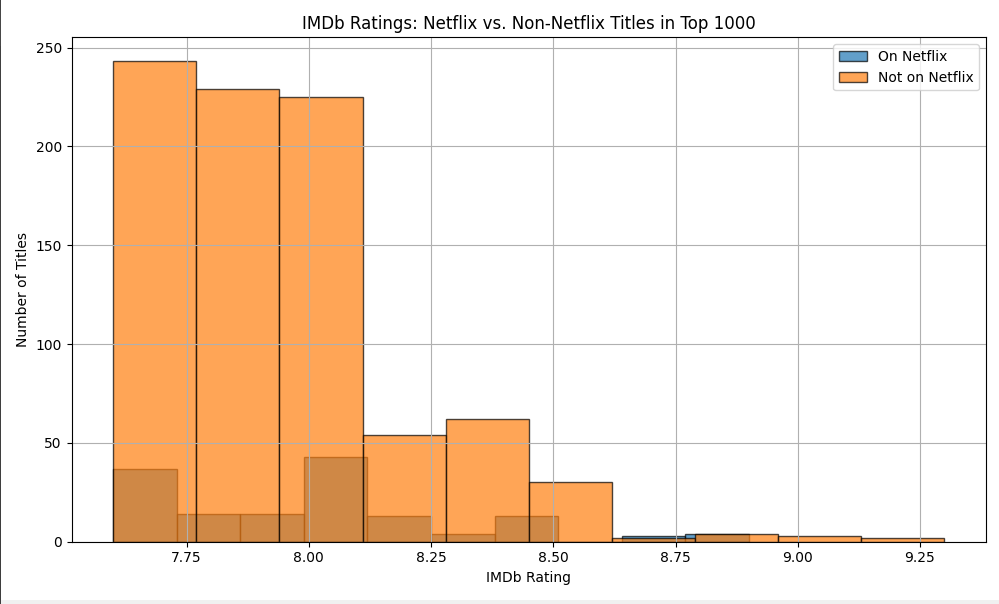

This was a personal learning project to practice data cleaning, merging, and visualization using real-world entertainment data. It helped me apply sqlite, Python and, pandas in a meaningful way while exploring an interesting cultural topic.

# Netflix vs IMDb: How Do Netflix Titles Compare?
This project analyzes how titles available on **Netflix** compare to the **IMDb Top 1000 movies**, using Python and public datasets. The goal is to understand whether Netflix content tends to be rated lower, the same, or better than other popular titles.

## Tools Used

- Python
- pandas
- matplotlib
- sqlite3

## What the Project Does

1. Loads two real datasets (Netflix and IMDb)
2. Cleans and standardizes title and year columns
3. Merges Netflix content with IMDb Top 1000 entries
4. Analyzes IMDb rating distribution of Netflix vs non-Netflix content
5. Exports merged data to both CSV and SQLite database
6. Runs SQL validation queries on the database

## ✅ Key Findings

- 145 titles from IMDb’s Top 1000 were found on Netflix
- Average IMDb rating for:
  - Netflix titles: **8.00**
  - Non-Netflix titles: **7.94**
- Netflix content in the Top 1000 performs just as well or slightly better than other top-rated content

## How to Run

1. Make sure Python is installed
2. Install dependencies (if not already installed):
   -pip install pandas matplotlib
3. 3. Place the following CSVs in the `Data/` folder:
- `netflix_titles.csv`
- `imdb_top_1000.csv`

4. Run the script: python Code/netflix_vs_imdb.py
5. Sample Output and SQL:

## Sample Output

Below is a visualization of IMDb ratings for Netflix titles:




## SQL Integration

To showcase SQL use for quality assurance, the merged dataset is exported into a local SQLite database (`netflix_vs_imdb.db`). From there, basic validation queries are executed, including:

- Retrieving top 5 highest-rated Netflix titles
- Checking for invalid IMDb ratings outside the expected 0–10 range
- Verifying data integrity

```sql
-- Top 5 highest rated Netflix titles
SELECT title, IMDB_Rating 
FROM netflix_imdb 
ORDER BY IMDB_Rating DESC

LIMIT 5;

-- Check for ratings outside valid range
SELECT title, IMDB_Rating 
FROM netflix_imdb 
WHERE IMDB_Rating < 0 OR IMDB_Rating > 10;
